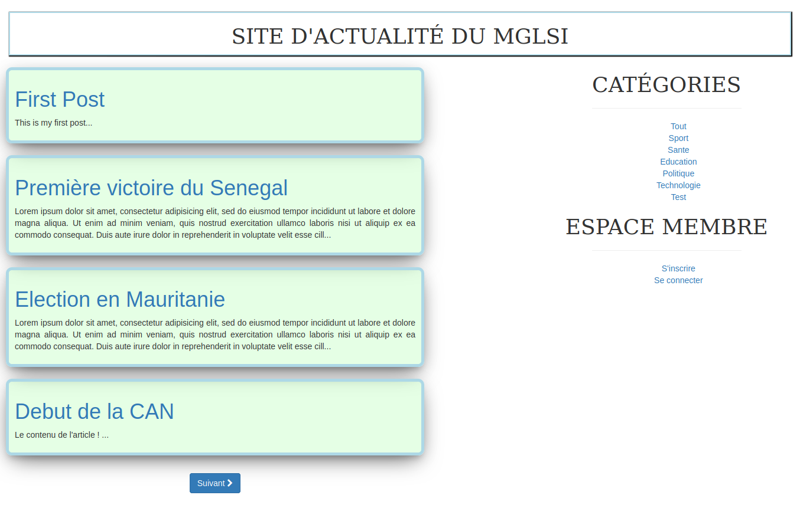

# Refactoring du blog + nouvelles features

Refactoring d'un blog en appliquant le motif MVC et la POO.

## Notes

En plus des dossiers `Model`, `Views` et `Controller`, j'ai ajouté quelques couches ou sous-couches
afin d'accentuer l'organisation du projet.

- Config

Ce repertoire contient comme son nom l'indique toute la configuration de l'app.
Le fichier `database.php` contiendra les paramètres de connexion à votre BD.
Le fichier `autoloader.php` permet le chargement automatique ou `autoloading` des classes lors de leurs instanciations (pas besoin de `require` ou `include`).

- Public

C'est ce dossier que vous devriez faire pointer votre serveur web. Il contient les ressources accessibles publiquement, c'est à dire tout ce qui est fichier statique (css, js, images, etc).
Il contient également un `index.php` faisant office de `FrontController`.

- Utilities

Contient un fichier nommé `helpers.php` contenant des fonctions utilitaires (`helpers`) et `HydratationTrait.php` où je définis une méthode permettant l'hydratation de n'importe quel objet.

- Model

Ce dossier représente la couche modèle au niveau du pattern `MVC` comme son nom l'indique.
Il a été découpé en sous-couches à savoir :

    - Entity
    Contenant les entités ou objets métier.

    - Manager
    Contenant les DAO de chaque entité.

    - Data
    Contenant une classe représentant la connexion à votre BD.

    - Service
    Contenant pour le moment une classe permettant de faciliter un peu plus la gestion des sessions (sorte de wrapper), ainsi qu'une autre dédiée à la validation.

- Controller

Contient les différents controlleurs de notre application.

- Api

Contient le code métier de notre `API REST`.

### NB

N'oubliez pas de renseigner les paramètres de configuration de votre BD au niveau de `Api/Rest/config/database.php` pour l'API.

## Authors

- [M.B.C.M](https://itdev.sn)
  

- [DEVAL](http://www.deval.website)
  

## Screenshots

